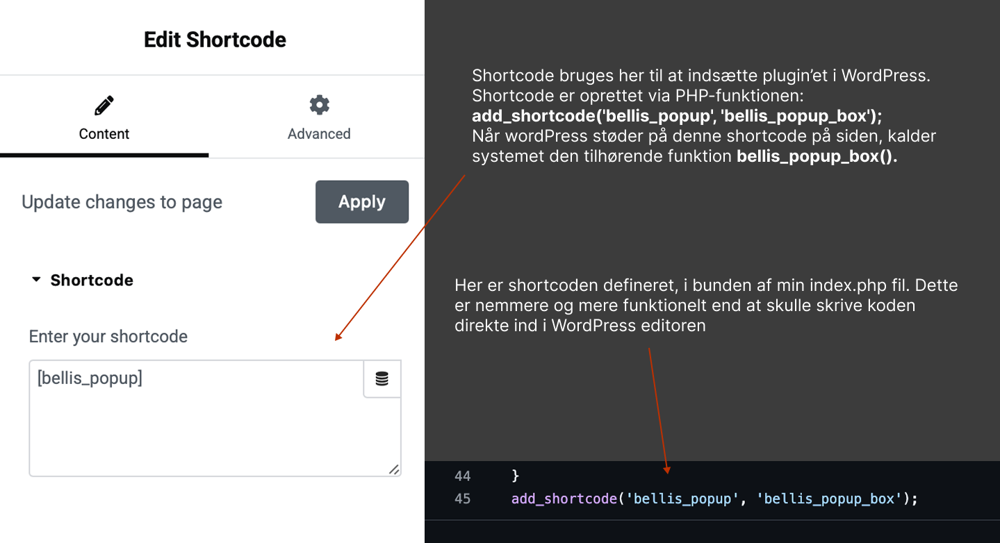
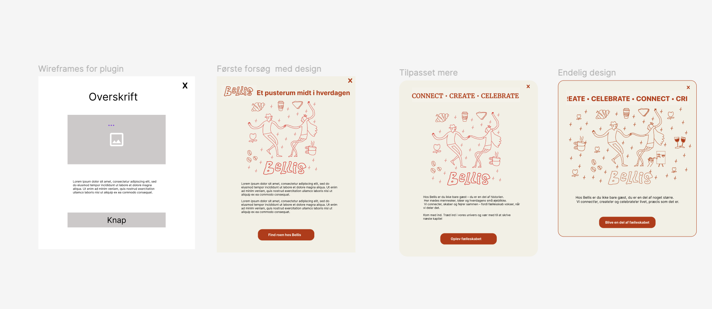
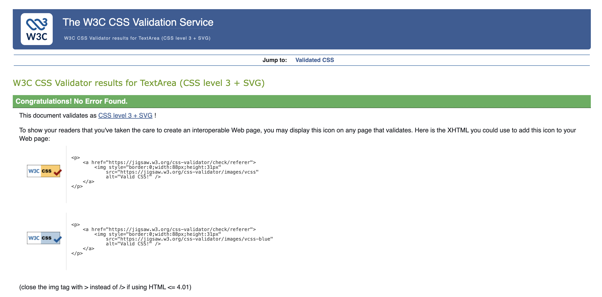

# Bellis Plugin

## Formålet med plugin’et

Jeg har udviklet et WordPress-plugin kaldet “Bellis Plugin”, som viser en popup-boks med et kørende slogan-bånd øverst og et mørkt overlay i baggrunden.  
Jeg har valgt at bruge et overlay, fordi det får baggrunden til at tone ned, så popup’en træder tydeligt frem for brugeren.

I toppen af boksen har jeg tilføjet et banner med teksten Connect, Create, Celebrate.  
Det er vores OI, og jeg har valgt at lade det køre som en animation for allerede fra start at sætte fokus på, hvad Bellis står for.

Jeg har selv tegnet illustrationerne, der bruges i billedet i popup’en, da jeg ønskede et mere roligt og personligt udtryk fremfor at bruge en video, som kunne virke for voldsom for brugeren.  Samt at det skulle hænge visuelt sammen med resten af Bellis’ univers, som vi har udviklet.

Farverne, jeg har brugt, er rød og beige, da det er de gennemgående farver på Bellis’ hjemmeside, og jeg ville skabe en rød tråd mellem popup’en og websitet. Sammen med banneret Connect, Create, Celebrate giver det et samlet og genkendeligt udtryk.

Formålet med plugin’et er at skabe en visuel og interaktiv introduktion til Bellis-universet, hvor popup’en byder brugeren velkommen og linker videre til vores underside *“Bag Bellis”*.

## Filstruktur

Mit plugin ligger i mappen:  
`/wp-content/plugins/bellis_plugin/`

Her har jeg samlet alle filer, der får plugin’et til at fungere.  
Mappen er bygget op sådan her:

bellis_plugin/
- img/ → indeholder billeder brugt i popup’en
- index.php → hovedfilen med al PHP- og HTML-strukturen
- script.js → JavaScript-filen, der styrer interaktivitet og animationstidspunkt
- style.css → CSS-filen med layout, farver og animationer

Jeg har valgt at strukturere plugin’et på denne måde, fordi det giver et tydeligt overblik over, hvad der styrer hvad.  


## HTML og PHP 

I starten af min PHP-fil har jeg tilføjet denne linje:

```php
if (!defined('ABSPATH')) exit;
Jeg har brugt den for at sørge for, at mit plugin kun kører, når WordPress er aktivt, og ikke kan misbruges ved at blive åbnet direkte.
```

Efter sikkerhedstjekket har jeg tilføjet:
```php
wp_enqueue_style();
wp_enqueue_script();
```
De sørger for, at mit plugin automatisk får hentet både CSS og JavaScript, når siden bliver vist.
Jeg har placeret dem i starten af koden, fordi de skal indlæses før popup’en vises.
Hvis jeg lagde dem i bunden, ville WordPress ikke kende filerne, når popup’en skal vises, og derfor kunne designet eller funktionerne måske ikke virke korrekt.

### Funktionen bellis_popup_box()
Funktionen bellis_popup_box() står for at bygge hele HTML-strukturen til min popup.
Her bliver alt indholdet samlet og sat op i den rækkefølge, det skal vises på siden.
Funktionen gør, at popup’en automatisk kan indsættes via shortcoden [bellis_popup] i WordPress.


Her begynder opbygningen af hele popup’en, og alt indhold gemmes i variablen $content.

```php
function bellis_popup_box() {
    // Starter med at opbygge popup-indholdet
    $content = '';
  ```

Derefter starter jeg med at lave en <div> til det mørke baggrundslag, som dæmper resten af siden, når popup’en vises.
```php
    // Mørkt overlay der dækker baggrunden
    $content .= '<div id="popup-overlay"></div>';
```
Derefter har jeg en container, som  sørger for, at popup’en bliver placeret midt på skærmen.
```php
 // Container der centrerer popup’en
    $content .= '<div id="bellis-container">';
```
Så har vi selve popup-boksen, som indeholder 
```php
    // Selve popup-boksen
    $content .= '<div class="bellis-box slide-top">';

    // Lukke-knappen (X)
    $content .= '<div class="bellis-close-button">&#10006;</div>';

    // Overskrift
    $content .= '<h2>FÆLLESSKABET STARTER HER</h2>';

    // Billede
    $content .= '';

    // Tekst
    $content .= '<p>Hos Bellis er du ikke bare gæst, du er en del af noget større.<br>
                 Vi connect’er, create’er og celebrate’er livet – præcis som det er.</p>';

    // CTA-knap
    $content .= '<div class="button-holder">';
    $content .= '<button id="bellis-button">Bliv en del af fællesskabet</button>';
    $content .= '</div>';

    // Luk popup-boks og container
    $content .= '</div>'; // .bellis-box
    $content .= '</div>'; // #bellis-container
  ```
 
 Til sidst i min html kode står der: 
```php
    return $content;
```
Det er fordi jeg tilsidst sender alt HTML-indholdet tilbage til WordPress, så det kan vises dér, hvor shortcoden [bellis_popup] bliver brugt.


Grunden til, at jeg bruger ( .= ) efter hvert sted hvor der står content, er fordi at det betyder at jeg tilføjernyt indhold til $content i stedet for at overskrive det, jeg allerede har skrevet.

I min PHP-fil har jeg også tilføjet mange kommentarer, så jeg hele tiden kan huske, hvad hver del gør.
Det gør det nemt for mig at arbejde videre senere, uden at glemme, hvordan koden hænger sammen.


Jeg har desuden tilføjet en shortcode i WordPress, så man kan vise popup’en hvor som helst på siden ved at indsætte:
[bellis_popup]
Det gør plugin’et fleksibelt og nemt at genbruge.


##  CSS 

I min **CSS-fil** har jeg arbejdet med både layout, farver og animationer for at få popup’en til at se indbydende og levende ud.

---

### Placering
Jeg har placeret popup-boksen midt på skærmen ved hjælp af Flexbox i min container.
Det gør, at popup’en altid står helt centreret både lodret og vandret – uanset skærmstørrelse eller hvor meget man scroller.
```css
#bellis-container {
  position: fixed;       
  inset: 0;              
  display: flex;        
  align-items: center;   
  justify-content: center; 
}
```
På den måde bliver popup’en fastgjort midt på skærmen og forbliver tydelig for brugeren

### Kørende banner

I toppen har jeg lavet et kørende banner med teksten
“Connect • Create • Celebrate”.

Den bevæger sig fra højre mod venstre ved hjælp af en @keyframes-animation, som gentager sig uendeligt.
```css
@keyframes marquee {
  0%   { transform: translateX(0); }
  100% { transform: translateX(-50%); }
}
```
Det skaber bevægelse og liv i designet, uden at det bliver for voldsomt for brugeren.

### Farver og stil
Selve popup-boksen har fået en blød beige baggrund, afrundede hjørner og en skygge, som får den til at træde tydeligt frem på siden. Farverne beige og rød går igen fra Bellis’ visuelle stil, så popup’en passer sammen med resten af websitet.

### Animation og bevægelse
Jeg har også tilføjet en slide-animation, hvor boksen glider ned fra toppen, når den vises, og glider op igen, når man lukker den. Det giver en rolig og behagelig overgang.

```css
.slide-top { transform: translateY(-150%); opacity: 0; }
.slide-down { transform: translateY(0); opacity: 1; }
```

### CTA knap
Teksterne er centrerede, og knappen har fået afrundede kanter og ændrer farve, når man holder musen over den. Det gør det tydeligt, at knappen er klikbar.

```css
.button-holder button:hover {
  background: #76250A;
}
```

### Overlay

Til sidst har jeg lavet et mørkt overlay, der dækker hele skærmen, når popup’en vises.  
Det dæmper baggrunden og får selve popup’en til at stå tydeligere frem.  
Overlayet har en let gennemsigtighed og et svagt slør, som giver et roligt og eksklusivt udtryk.

Jeg har også tilføjet en glidende fade-animation, så overgangen føles mere naturlig, når popup’en åbner og lukker.

```css
#popup-overlay {
  position: fixed;
  inset: 0;
  background: rgba(0, 0, 0, 0.45);
  backdrop-filter: blur(2px);
  opacity: 0;
  transition: opacity 0.4s ease;
}

#popup-overlay.active {
  opacity: 1;
}
```
Når popup’en aktiveres, får overlayet klassen .active, som ændrer opacity fra 0 til 1.
Det betyder, at baggrunden gradvist bliver mørkere, i stedet for at skifte pludseligt.
Denne effekt giver popup’en en mere behagelig og professionel brugeroplevelse.


## JavaScript

I min JavaScript-fil har jeg brugt Vanilla JavaScript til at skabe liv og interaktivitet i popup’en.   
Koden gør, at popup’en både åbner og lukker på en glidende og naturlig måde, og at den reagerer på brugerens handlinger.

Jeg starter med at sikre, at hele dokumentet (DOM) er indlæst, før koden kører.  
Det gør jeg med `DOMContentLoaded`, som sørger for, at JavaScript’et først går i gang, når alt indholdet på siden er klar:

```js
// Når hele dokumentet (DOM) er klar, starter JavaScript-koden
document.addEventListener('DOMContentLoaded', function() {
```

Herinde finder jeg popup-boksen og overlayet og gemmer dem i variabler, så jeg kan styre dem senere:
```js
var box = document.getElementById('bellis-box');       // Selve popup-boksen
var overlay = document.getElementById('popup-overlay'); // Det mørke overlay bag popup’en
```
### Animation og timing
Min animation for, hvordan popup’en skal glide, ligger i min CSS, hvor jeg har defineret klasserne .slide-top og .slide-down.
JavaScript’en styrer derimod hvornår animationen skal ske..

Jeg skjuler popup’en fra starten ved at tilføje klassen .slide-top:
```js
box.classList.add('slide-top');
```

Derefter får jeg den til automatisk at glide ned efter ét sekund med setTimeout():
```js
setTimeout(function() {
    box.classList.remove('slide-top');
    box.classList.add('slide-down');
    overlay.classList.add('active'); // Gør overlayet synligt
}, 1000);
```
Hvis jeg kun havde CSS’en, ville popup’en blive vist med det samme, så snart siden blev indlæst uden nogen forsinkelse.
Ved at bruge JavaScript kan jeg bestemme præcis, hvornår animationen skal starte, så popup’en glider roligt ned efter et kort øjeblik, i stedet for at stå der fra starten.


### Klikfunktioner

Derefter har jeg lavet forskellige klikfunktioner, som gør plugin’et interaktivt:

Når man klikker på X’et, lukker popup’en, og overlayet forsvinder:
```js
var closeBtn = document.getElementById('bellis-close');
closeBtn.addEventListener('click', function() {
    box.classList.remove('slide-down');
    box.classList.add('slide-top');
    overlay.classList.remove('active');
});
```

Når man klikker på “Bliv en del af fællesskabet”, bliver man sendt videre til siden Bag Bellis:
```js
var ctaBtn = document.getElementById('bellis-button');
ctaBtn.addEventListener('click', function(e) {
    e.preventDefault(); // Forhindrer evt. standardknapadfærd
    window.location.href = 'https://storyscaping.shstudio.dk/elementor-615/home/
});
```

Hvis man klikker udenfor popup’en, altså på overlayet, lukker den også automatisk:
```js
overlay.addEventListener('click', function() {
    box.classList.remove('slide-down');
    box.classList.add('slide-top');
    overlay.classList.remove('active');
});
```
Jeg har valgt at lave det sådan, fordi det er den måde, brugerne typisk forventer, at en popup fungerer på.
Det giver en mere naturlig og brugervenlig oplevelse, hvor man nemt kan lukke vinduet igen eller vælge at gå videre.

##  Shortcode

For at vise mit plugin i **WordPress** har jeg lavet en shortcode, som hedder:

[bellis_popup]

For at få den til at fungere går jeg ind på den side i WordPress, hvor jeg vil vise popup’en,og indsætter shortcoden direkte i teksteditoren.  

Når WordPress ser shortcoden, henter den automatisk alt det indhold, jeg har bygget i mit plugin.  
Det gør det nemt at placere popup’en præcis der, hvor jeg ønsker den på siden.

###  Oprettelse af shortcoden i PHP

Jeg har oprettet shortcoden i min PHP-fil med denne linje:

```php
add_shortcode('bellis_popup', 'bellis_popup_box');
Det betyder, at når jeg skriver [bellis_popup] i WordPress,
så kalder den funktionen bellis_popup_box(), som indeholder hele HTML-strukturen til popup’en.
```

På den måde bliver alt det, jeg har bygget både HTML, CSS og JavaScript
automatisk hentet og vist det rigtige sted på hjemmesiden.



##  Skitser 
For at få et bedre overblik over, hvordan jeg ville opbygge mit plugin, startede jeg med at lave en wireframe i Figma. Her fokuserede jeg på struktur, layout og de vigtigste elementer som overskrift, tekst, billede og knap – uden at tænke på farver eller detaljer.

Herefter begyndte jeg at arbejde videre med designet og eksperimenterede med forskellige tekstudtryk for at finde den rette tone og stemning. Jeg tegnede mine egne illustrationer i Illustrator for at skabe et personligt og genkendeligt udtryk, der passede til Bellis’ visuelle identitet.

Undervejs justerede jeg layout, farver og typografi for at skabe bedre balance og hierarki i designet. Processen endte med et endeligt design, der har en tydelig rød tråd til vores hjemmeside, da jeg har inkorporeret flere af de samme elementer bl.a. banneret i toppen med CONNECT • CREATE • CELEBRATE




##  Validering af css
For at sikre kvaliteten af min kode har jeg valideret min CSS ved hjælp af W3C CSS Validatoren (Jigsaw). Resultatet viste, at der ikke var nogen fejl i min CSS.


##  Min popup

